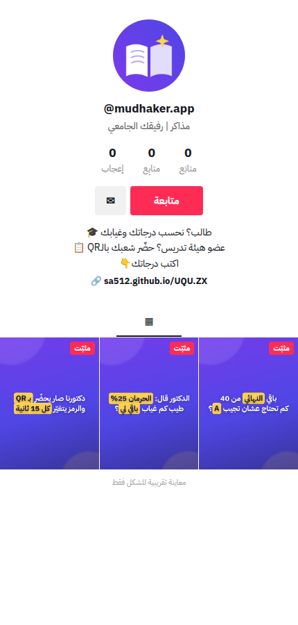

# حساب مذاكر في تيك توك: التجهيز والانطلاق

## 1) بيانات الحساب (انسخها كما هي)

| الحقل | القيمة | ملاحظة |
|---|---|---|
| **صورة الحساب** | `marketing/brand/tiktok-avatar.png` | البديل الليلي: `tiktok-avatar-dark.png` |
| **اسم المستخدم** | `mudhaker.app` | بدائل بالترتيب: `mudhaker_sa` · `mudhakerapp` · `mudhaker.uni` |
| **الاسم** | `مذاكر \| رفيقك الجامعي` | 21 حرفاً، والحد 30 |
| **البايو** | `طالب؟ نحسب درجاتك وغيابك 🎓 عضو هيئة تدريس؟ حضّر شعبك بالـQR 📋 اكتب درجاتك👇` | 74 حرفاً، والحد 80. يخاطب الطالب وعضو هيئة التدريس |
| **الرابط** | `https://sa512.github.io/UQU.ZX` | متى ما أتاحه تيك توك للحساب |

**بايو بديل** (78 حرفاً): `للطالب: درجاتك وغيابك وجدولك 🎓 ولعضو هيئة التدريس: التحضير والشعب والدرجات 👨‍🏫`

- اسم المستخدم يُكتب بحروف إنجليزية وأرقام و`_` و`.` فقط، وتيك توك يسمح بتغييره مرة كل 30 يوماً. اختره صح من أول مرة.
- **احجز نفس الاسم** في سناب وإنستقرام وX عشان تكون الهوية موحّدة.

## 2) الإعدادات

1. **نوع الحساب:** حساب أعمال (Business)، وفئته «تعليم». يعطيك إحصائيات مفصلة ومكتبة الموسيقى التجارية.
2. **اللغة والمنطقة:** العربية والسعودية.
3. **التعليقات والدويتو والستيتش:** مفتوحة للجميع، لأن الانتشار يعتمد عليها.
4. **الرسائل:** مفتوحة للمتابعين.

## 3) قبل أول مقطع

- [ ] ارفع صورة الحساب، واكتب الاسم والبايو.
- [ ] جهّز المقاطع الثلاثة الجاهزة (`01`، `02`، `03`).
- [ ] اتفق مع 5–10 من ربعك أو زملاء الدفعة يشوفون المقاطع كاملة ويعلّقون في أول ساعة.
- [ ] جهّز رسالة قروبات الدفعة من `marketing/content-kit.md`.

## 4) أول 7 أيام

| اليوم | انشر | افعل بعدها |
|---|---|---|
| 1 | `01-final-grade` مع وصف «اكتب درجاتك في التعليقات وأحسبها لك 👇» | رد على كل تعليق خلال ساعة |
| 2 | `02-absence` | ثبّت أفضل تعليق |
| 3 | `03-qr-attendance` | ثبّت المقاطع الثلاثة في أعلى الحساب |
| 4 | رد بمقطع على أفضل تعليق فيه درجات | ابدأ سلسلة «احسبها لك» |
| 5 | Stitch مع مقطع طالب يشتكي من الغياب أو الدرجات | علّق على 10 مقاطع طلاب جامعيين |
| 6 | «جدولي صار خلفية جوالي» | أرسل للسفراء |
| 7 | راجع الإحصائيات | كرّر أسلوب المقطع الأعلى بخطّاف جديد |

## 5) مراحل النمو

| المرحلة | الهدف | التركيز |
|---|---|---|
| 0 → 100 متابع | إثبات أن المحتوى يوصل | مقطع يومياً، والرد على التعليقات بمقاطع |
| 100 → 1,000 | سلسلة ثابتة يعرفك الناس بها | «احسبها لك»، ونسخة لكل جامعة |
| 1,000 → 10,000 | ركوب المواسم | الفصليات والنهائيات ويوم النتائج، والبث المباشر |
| 10,000+ | تحويل المتابعين لمستخدمين | الرابط، وSpark Ads على أفضل مقطع، وشراكات الأندية |

## 6) أعمدة المحتوى

وزّع المقاطع على هالأنواع حتى ما يتكرر الحساب:

- **40% «احسبها لك»:** حساب درجات وغياب ومعدلات حقيقية من المتابعين.
- **25% حياة الطالب:** اسكتشات ومواقف مثل «الدكتور لما…» و«أنا ليلة الاختبار».
- **20% نصائح سريعة:** مذاكرة، وتنظيم، وخطة مراجعة.
- **15% التطبيق مباشرة:** ميزة واحدة في كل مقطع.

القواعد الكاملة للانتشار في [`VIRAL.md`](VIRAL.md).
